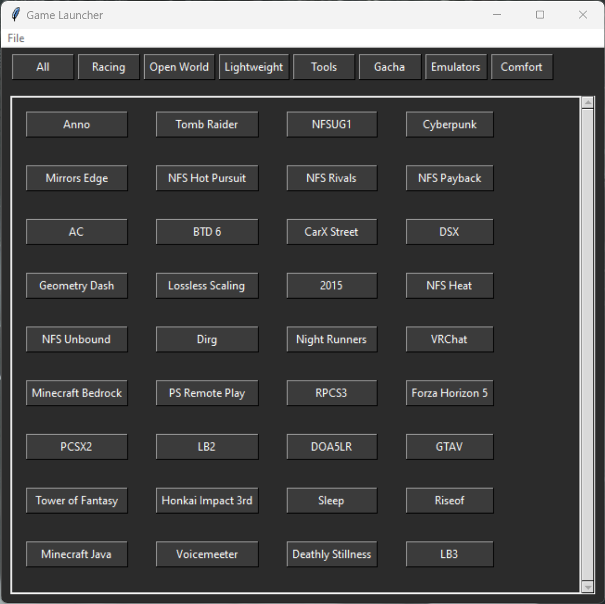
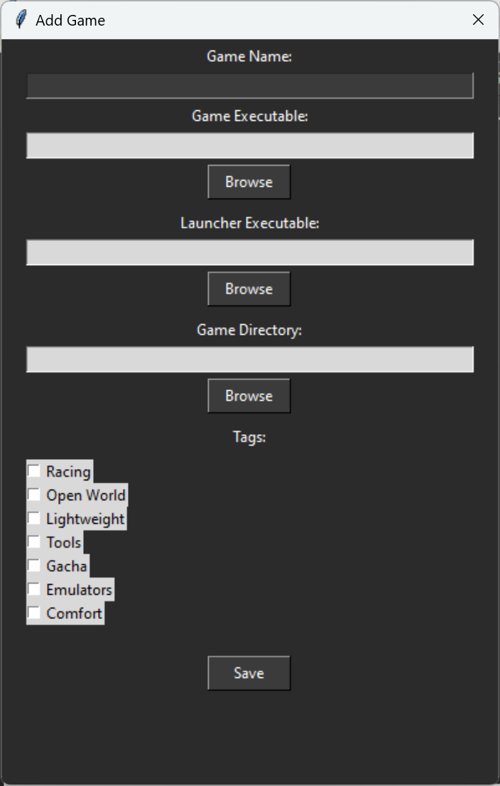
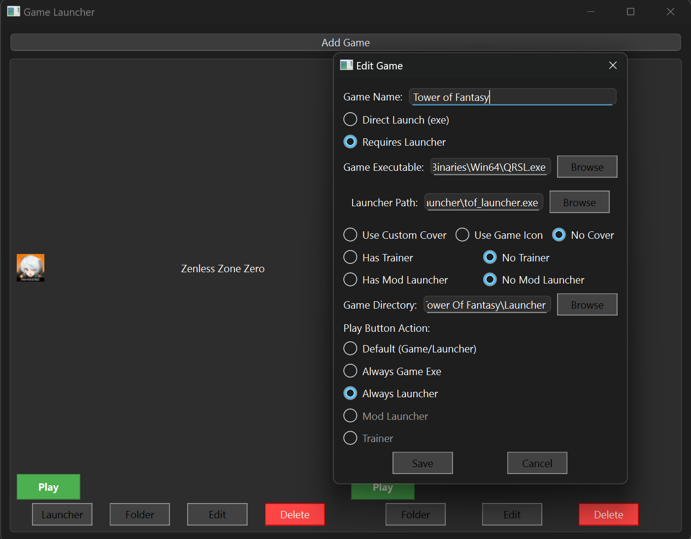

# 🎮 GameLauncher
*A customizable game launcher with mod and file management support*

<!--[GameLauncher Banner] <!-- Replace with actual image link later -->

---

## 🚀 Overview
**GameLauncher** is a custom game launcher designed to provide features that many existing launchers lack. It allows users to:  

✔️ Add games from various platforms and locations on their PC  
✔️ Manage mods and trainers with a built-in mod launcher option  
✔️ Open game directories for quick file access (useful for modding or tweaks)  
✔️ Launch games directly from one centralized interface  

Currently, I have already built a **functional version** using Python, but the UI is very basic. My goal is to **rebuild this with a better interface** and possibly use a different programming language to enhance its design and functionality.  

---

## 🎯 Current Features
### Legacy Python Version

- ✅ **Game Management:** Add any game from your PC by specifying:  
  - The game's executable file (for directly launching the game) 
  - A mod launcher (if available)  
  - The game directory (for easy file access)
  - Add a tag/category (for easy sorting)
- ✅ **Multiple Launch Options:** Click on a game to:  
  - Run the base game  
  - Open the mod launcher  
  - Open the game directory
  - Edit name, directories, and tags 

📸 

### New Python Version

- ✅ **Game Management:** Add any game from your PC by specifying:  
  - The game's exe (and launcher if it uses one)
  - Cover art (choose the game's exe icon or custom cover art)
  - A mod launcher (if available)  
  - The game directory (for easy file access)
  - Specify play button action (choose to launch with mods, trainer base game etc.)
- ✅ **Multiple Launch Options:** Multiple buttons to launch:  
  - The base game/launcher  
  - Open the mod launcher
  - Open the trainer  
  - Open the game directory
  - Edit name, directories, and default launch options
 
    

---

## 🔥 Future Plans
🔹 **Improved UI:** Create a cleaner, modern-looking UI similar to popular launchers  
🔹 **Better Tech Stack:** Possibly switch from Python to a different language for performance and design improvements  
🔹 **More Features:**  
   - Better sorting/filtering features    
   - Customizable themes
   - Custom Artwork for games

---

## 🛠️ Tech Stack (Current & Future)
- **Current Version:** Python (basic UI)  
- **Potential Future Tech:**  
  - C# with **WPF / WinUI 3** (for a native Windows experience)  
  - **Electron (JavaScript)** (if cross-platform is needed)  
  - **Flutter (Dart)** (if targeting modern UI design)  

---

## 📸 Screenshots  
<!-- Add screenshots here when available -->  

Will add when further development has been made on newer version~

---
